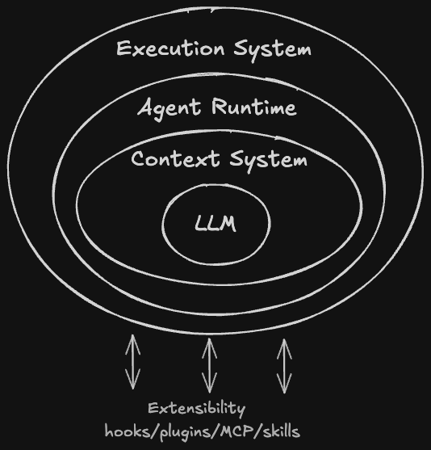

# Inside the Agent Harness

A four-part series exploring how modern agent harnesses are actually built,
using Claude Code, Codex, Pi, and DeepSeek Harness as case studies.

**By Wenbo Qiao** · [LinkedIn](https://www.linkedin.com/in/wenbo-3q/)

## Series

1. **[Anatomy of a Coding Agent](part-1-anatomy.md)** — Published
2. **Inside the Agent Loop** — Coming soon
3. **Context Is the Runtime** — Coming soon
4. **What Belongs in the Harness?** — Coming soon

## About This Series

The goal is not to rank agent frameworks or compare feature lists.

Instead, the series looks at source code and implementation evidence to understand the architectural decisions behind modern agent systems: context management, runtime design, execution, extensibility, and the trade-offs between them.

## Sources

Each article includes its own references. Pi, DeepSeek Harness, and Codex are studied from their public repositories.

Claude Code is not open source. The analysis is based on TypeScript source content exposed through the v2.1.88 npm sourcemap, cross-checked against independent source-level analysis.