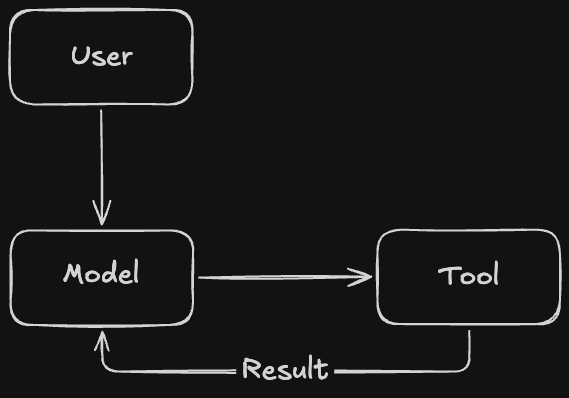
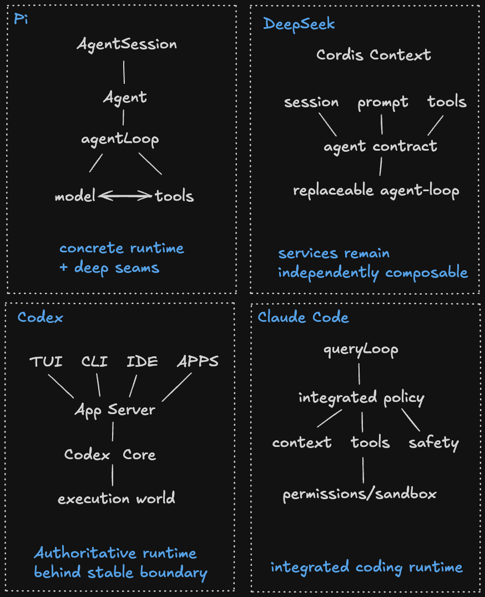
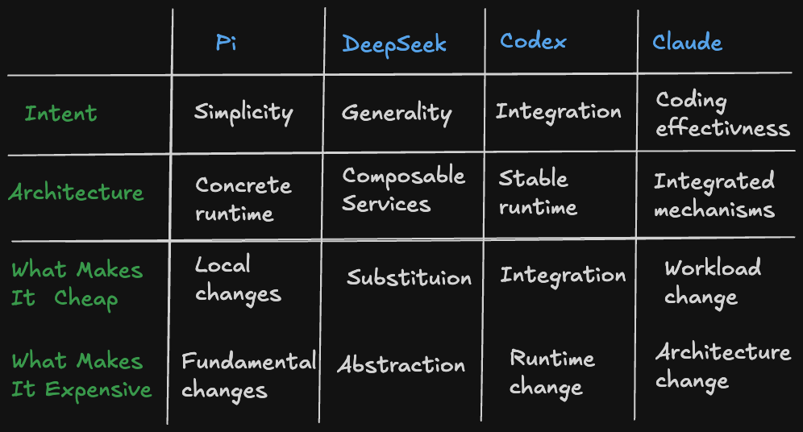
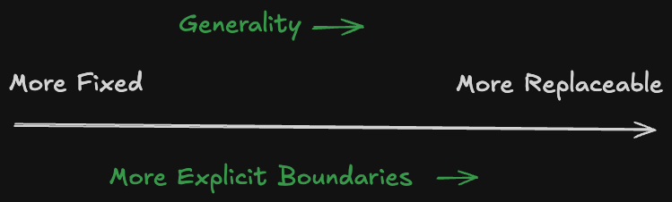

# Inside the Agent Harness

*What Claude Code, Codex, Pi, and DeepSeek Teach Us About Agent System Architecture*

**Part I of a four-part series: Anatomy of a Coding Agent**

~15 min read

## 1. Same Model, Different Harness

Here is something I have been thinking about lately:

**How much of a coding agent's performance actually comes from the model?**

We usually talk about coding agents by their model names. Claude is better at this. GPT is better at that. A new model comes out, benchmarks move, and naturally we give most of the credit to the model.

But change the harness around the same model, and the result can change quite a lot.

A recent Databricks benchmark made this especially visible. They took real engineering tasks from their multi-million-line production codebase and ran the same model, with the same thinking effort, through different harnesses.

One was the model's native harness, Claude Code or Codex. The other was Pi, a much smaller open-source coding harness.

The quality was roughly the same in the comparison they highlighted.

The cost was not.

In some cases, cost per task differed by more than 2x. Pi sent roughly 3x less context to the model per turn and often finished the task in fewer runs. [1]

Databricks is not the only one seeing this. Recent research comparing the same models across different harnesses has reported sizeable differences in benchmark scores, token efficiency, and even failure behavior. [2]

So there is an interesting contradiction here.

The model is supposed to be the intelligence.

The harness is supposed to be the machinery around it.

**Why does changing the machinery change the behavior of the intelligence so much?**

That question is what got me interested in looking deeper into agent harnesses.

In this four-part series, I am going to use **Claude Code, Codex, Pi, and DeepSeek Harness** as case studies. Not to rank them, and not to make another feature comparison. I want to look at how they are actually designed, what problems their architectures are trying to solve, and why their designers made very different choices around what sits between the model and the real world.

If you use coding agents every day, are curious about what is really happening underneath the current wave of vibe coding, or have thought about building an agent harness yourself, I think this is a useful layer to understand.

And to understand it, I want to start with the smallest possible version of one.

## 2. Strip Everything Away

Before digging into Claude Code or Codex, I wanted to answer a simpler question:

**How little code does it actually take to build a coding agent?**

Surprisingly little.

Strip away the UI, permissions, sandboxing, plugins, subagents, and all the other machinery, and the core idea looks something like this:

```python
messages = [user_request]

while True:
    response = model(messages)
    messages.append(response)

    if not response.tool_calls:
        return response

    for call in response.tool_calls:
        result = execute(call)
        messages.append(result)
```

Give the model a few useful tools, such as reading files, editing files, searching the repository, and running shell commands, and you already have the basic shape of a coding agent.

The model looks at what it knows, decides what to do next, calls a tool, sees the result, and decides again.



There is nothing particularly exotic about this loop.

And that is exactly why it is a useful place to start.

Claude Code, Codex, Pi, and DeepSeek Harness are obviously much more than this. But underneath all of their architecture, some version of this basic interaction still exists: **model, tools, results, repeat.**

So the interesting question is not how the loop works.

It is what happens when we try to make this tiny loop do real work.

Give it a large repository. Let it run for an hour. Allow it to execute arbitrary commands. Interrupt it halfway through. Fill its context window. Ask it to recover from its own mistakes.

Very quickly, those few lines stop being enough.

**The question is what we have to add, and why.**

## 3. When the Loop Meets Reality

The minimal loop is enough to make an agent work. The moment we expect it to work reliably on real software projects, a lot more has to happen around it.

### Context stops being just messages

A coding agent is constantly accumulating information: repository instructions, files it has read, search results, tool outputs, test failures, conversation history, and its own previous work. All of that competes for a finite context window.

So context can no longer be treated as a growing `messages` array. Something has to decide what the model sees on each turn, what remains in the working set, what gets compacted, and what can be dropped.

### Tool calls become real execution

In the minimal loop, every tool call goes through `execute(call)`. In a real coding environment, that abstraction hides very different operations.

Reading a file is cheap and relatively safe. Running a shell command may take twenty minutes, modify the repository, access the network, or generate megabytes of output.

Now we have to think about concurrency, timeouts, cancellation, output handling, permissions, and execution isolation.

### The loop needs a lifecycle

Real tasks are long-running. Users interrupt or redirect the agent. Commands fail. Processes restart. The agent may need to recover from a bad edit or resume an earlier session. A UI needs to know what is happening while all of this is going on.

The simple loop starts picking up state, events, persistence, steering, and recovery.

### The harness needs to grow

A useful harness rarely stays with its original set of tools and behaviors. New tools, MCP servers, hooks, skills, model providers, subagents, and product integrations all need ways to participate without turning the core loop into a collection of special cases.

Context policy affects tool usage and cost. Parallel execution affects state consistency. Sandboxing constrains how tools run. Subagents introduce their own context and lifecycle. Extensions may need to intercept several parts of the execution path.

This is roughly the point where the small agent loop from the previous section starts turning into an agent harness.

Modern harnesses run into many of the same problems. What makes them interesting is that they make surprisingly different choices about how to solve them and where those solutions should live.

Before looking at Claude Code, Codex, Pi, and DeepSeek individually, we need a common way to describe those choices.

## 4. Anatomy of a Modern Agent Harness

Once the minimal loop is surrounded by what it needs to operate in the real world, a recognizable structure starts to emerge.

One useful way to look at the harness is as a set of layers around the model. Each layer adds a different system responsibility between the model and the environment.

At the center is the model. Around it sit three layers: the **Context System**, the **Agent Runtime**, and the **Execution System**.


The layers describe conceptual responsibilities, not literal software containment.

### Context System: What does the model know?

The model does not see the repository or environment directly. It works from the context assembled for it.

Instructions, conversation history, repository context, tool results, working memory, and compaction all belong here. Together they determine the model's working view of the task at each turn.

### Agent Runtime: How does the agent keep running?

The runtime turns individual model calls into continuous, stateful execution.

It manages the loop, turns, sessions, lifecycle, events, and orchestration. Interruption, steering, resume, delegation, and termination also have to fit into this layer.

### Execution System: How does a decision become an action?

The execution system connects model intent to the environment.

It exposes and dispatches tools, manages execution and concurrency, handles failures, and enforces boundaries around permissions, approvals, sandboxing, filesystem access, and network access.

### Extensibility Cuts Across the Harness

Extensibility is not another layer. It cuts across the other three.

A tool extends execution. A hook can intercept runtime events. An MCP server can introduce new capabilities. Extensions can inject context or change behavior around the loop.

What matters architecturally is therefore not simply whether a harness is extensible, but where it can be extended and how deep those extension points reach.

### A Map, Not an Answer

This anatomy is a map, not a prescription.

Some boundaries are deliberately unclear. Planning can emerge from the model, context, or runtime. A subagent can look like a tool in one system and a runtime primitive in another. Memory and persistent state can overlap.

Rather than resolving those questions in the abstract, we can use this anatomy as a framework for examining real implementations.

In the next section, I will use the same four questions to read each harness:

**Context:** What shapes the model's working view?

**Runtime:** What keeps the agent running and stateful?

**Execution:** What turns model decisions into controlled actions?

**Extension:** Where can the system be changed or extended?

I won't force the implementations into these boxes. Some of the most revealing design choices sit exactly at the boundaries between them.

Only after that can we ask the more interesting architectural question:

**Why did these systems draw their boundaries differently, and what trade-offs follow from those choices?**

## 5. Four Harnesses, Four Implementations

We now have a common map: **Context System, Agent Runtime, Execution System**, with extensibility cutting across them.

For Pi, DeepSeek Harness, and Codex, the evidence comes from their public source repositories. Claude Code is different. Anthropic does not publish its source, but version 2.1.88 shipped its original TypeScript through `sourcesContent` in an npm sourcemap. For Claude Code, I use that snapshot together with independent source-level analysis. [9]

This is not a feature inventory. We are looking for architecture in the code.



### 5.1 Pi: A Small, Concrete Runtime

Mapped onto our anatomy, Pi has a fairly recognizable shape:

```text
Context      -> context transforms, prompt, session history, compaction
Runtime      -> AgentSession -> Agent -> agentLoop
Execution    -> built-in tools -> host environment
Extension    -> hooks across context, runtime, and execution
```

#### A small loop, a larger session

At the bottom of Pi's runtime is `agentLoop`, where the familiar model -> tool -> result cycle remains easy to follow.

A stateful `Agent` sits above it, owning runtime state, tools, events, steering and follow-up queues, and cancellation. Above that, `AgentSession` brings together the coding-agent session layer and surrounding lifecycle and extension behavior. [3]

This shows what "minimal" means in Pi. The execution primitive can stay small while the application around it grows.

#### Extensions cut through the runtime

Pi's extension system is built around what I will call **seams**: deliberate interception points inside an otherwise concrete runtime. The runtime itself remains intact, but extensions can step into selected parts of its control flow.

`AgentSession` is where these extension behaviors come together, including context, tools, lifecycle, session behavior, and compaction. [3]

The runtime stays concrete. The seams make selected parts of it easy to change.

#### What Pi deliberately leaves out

Pi does not include a built-in permission system for restricting filesystem, process, network, or credential access. By default, its tools inherit the authority of the user and process running Pi. Stronger boundaries can be provided through extensions or external isolation. [4]

Execution safety is still a real system responsibility. Pi simply chooses not to make all of it part of the core runtime.

### 5.2 DeepSeek Harness: Composition as the Architecture

```text
Context      -> systemPrompt + session projection + context plugins
Runtime      -> agent contract + agent-loop + session services
Execution    -> scoped tools + sandbox + permission capabilities
Extension    -> Cordis services and events across nearly everything
```

#### Even the loop is replaceable

DeepSeek's architecture documentation states its principle directly: **everything is a plugin**. Model adapters, tool registries, session services, prompt construction, and the agent loop itself are composed through Cordis. [5]

The distinction between `agent` and `agent-loop` makes this concrete. `agent` defines the public contract and registry, while `agent-loop` is the default concrete implementation. Other components can depend on the contract rather than the loop implementation. [5]

Extensibility here is not simply a set of hooks around a runtime. Much of the runtime is itself assembled from replaceable services.

#### State as an event log

DeepSeek stores runtime history as an append-only stream of `SessionEvent`s. Model history is derived from that log rather than maintained as a separate canonical transcript. Compaction operates over this representation as another capability, while the underlying durable events remain recorded. [6]

The model's context is therefore a projection of runtime state rather than the runtime state itself.

#### Scoped composition in practice

The reason for this architecture becomes easier to see in DeepSeek's agent presets. Different agent configurations can share host infrastructure while changing prompts, tools, and context behavior. Code Mode, for example, can expose `run_code`, allowing the model to express several operations as a TypeScript program instead of issuing each operation as a separate native tool call. [5]

The shared infrastructure remains in place. The agent-facing composition changes.

### 5.3 Codex: The Harness as a Product Runtime

```text
Context      -> instructions + history + StepContext + compaction/memory
Runtime      -> Thread -> Turn -> Step
Execution    -> ToolEnvironment + sandbox + approvals + permissions
Extension    -> MCP, skills, plugins, apps, extension tools
```

#### One runtime, multiple products

Codex separates its product surfaces from the runtime through the App Server boundary. The same App Server semantics are preserved for in-process clients such as TUI and exec rather than exposing direct core runtime handles. [7]

The harness is therefore not tied directly to one interface.

#### A consistent world for every model step

Inside a turn, Codex may call the model several times. Before each sampling request, it captures a `StepContext`: a request-scoped view of the model, instructions, available tools, environment, approval policy, sandbox state, and other capabilities. The turn loop captures that view so context, advertised tools, and tool calls share the same request-time world. [8]

The context presented to the model and the capabilities advertised to it therefore come from the same request-time view.

#### Execution belongs to the runtime

Execution context, approvals, permission requests, user interaction, and granted permissions are represented directly in Codex runtime state. Even subagents illustrate this boundary: what appears to the model as an agent-spawning capability is backed by another runtime thread with its own context and lifecycle. [8]

Codex also implements compaction as part of the runtime, including local and provider-backed strategies. [8]

### 5.4 Claude Code: A Pragmatic, Integrated Harness

```text
Context      -> CLAUDE.md + history + memory + context reduction
Runtime      -> shared queryLoop + session lifecycle + delegation
Execution    -> tool assembly + permissions + hooks + sandbox
Extension    -> hooks + skills + plugins + MCP
```

Its implementation tends to solve these responsibilities through several specialized mechanisms rather than one dominant architectural abstraction.

#### Reduce context before replacing it

Claude Code uses multiple forms of context reduction rather than relying on one compaction event. The v2.1.88 snapshot contains a substantial compaction subsystem, while source-level analysis shows a broader pattern of applying cheaper context-reduction mechanisms before falling back to more aggressive semantic compaction. [9]

The exact path depends on runtime conditions, so this is not one fixed sequence. The implementation pattern is gradual context reduction rather than a single compaction event.

#### Policy shapes the model's action space

Claude Code assembles the model-visible tool pool before inference, with policy filtering participating in that assembly. Its execution path then adds permission handling, hooks, and sandboxing. [9]

The same policy can therefore influence the action space presented to the model and enforce boundaries again when an action reaches execution.

#### Sometimes another context is the boundary

Claude Code distinguishes between expanding the current context and delegating work into an isolated agent context. Subagent work is kept separately, and a compressed result returns to the parent rather than the entire child history. [9]

Delegation therefore also becomes a way to control context growth and isolate working state.

Claude Code's extension mechanisms follow a similarly specialized pattern. Hooks, Skills, Plugins, and MCP operate at different intervention points rather than passing through one universal extension abstraction. [9]

### 5.5 One Problem, Four Placements

Compaction is a useful example because every long-running agent eventually faces the same constraint: its working history grows faster than the model can carry it indefinitely.

All four harnesses compact context. But the responsibility sits in a different place.

| Harness | Architectural placement |
| --- | --- |
| **Pi** | Part of the coding-agent session and context machinery. |
| **DeepSeek Harness** | A replaceable capability operating over event-sourced session state. |
| **Codex** | An integrated runtime lifecycle with multiple compaction strategies. |
| **Claude Code** | Graduated context-reduction mechanisms surrounding the coding loop. |

**Compaction is one responsibility. Four harnesses give it four different architectural homes.**

The same pattern appears elsewhere in the systems we just examined. Now we can step back from the implementations and look at the boundaries themselves.

## 6. Where They Draw the Boundaries

Compaction gave us one concrete example. Across the rest of the harness, the same pattern keeps appearing: **the responsibilities remain recognizable, but their ownership moves.**

### 6.1 Same Anatomy, Different Boundaries

| Responsibility | Pi | DeepSeek Harness | Codex | Claude Code |
| --- | --- | --- | --- | --- |
| **Context** | Session machinery + extension seams | Distributed across composable services | Runtime-owned request view | Integrated, specialized mechanisms |
| **Runtime** | Concrete core | Composable and replaceable | Authoritative core | Integrated coding runtime |
| **Execution policy** | Core tools + externalizable safety | Composable capabilities | First-class runtime state | Deeply integrated, layered policy |
| **Extensibility** | Cross-cutting seams | Composition model | Controlled extension surfaces | Specialized extension mechanisms |

Pi's safety model is a useful example. Execution safety belongs in our harness anatomy, but that does not mean Pi has to own all of it in its core. Some of that responsibility can live in an extension, sandbox, container, or host environment.

**A responsibility can belong to the harness without belonging to the harness core.**

Pi's seams illustrate the same idea from another angle: the runtime remains concrete while selected responsibilities can be intercepted around it. DeepSeek moves the boundary further by making many of the components themselves replaceable.

### 6.2 Architecture Follows the Application

It is tempting to look at these implementations and ask which architecture is cleaner.

That comparison is not very useful unless we first ask what each system is designed to carry.

**Pi** is primarily a coding agent running in a developer environment. Its project documentation emphasizes a minimal terminal coding harness designed to be adapted through extensions. [3]

**Claude Code** is also designed around coding, but its architecture reflects the operational pressure of a production coding agent. Its shared loop is surrounded by integrated context management, permission handling, tool assembly, persistence, and execution mechanisms. [9]

**Codex** has another requirement: one runtime needs to support multiple product surfaces. The App Server boundary is concrete evidence of that product pressure. [7]

**DeepSeek Harness** takes the most general-purpose approach of the four. Its architecture explicitly treats the harness as a composition of replaceable plugins and services, and its presets demonstrate different agent behavior over shared host infrastructure. [5]

The point is not that any of these requirements dictates one architecture.

It is that architecture only makes sense relative to the application it is serving.

**Before judging a harness architecture, ask what it is designed to carry.**

### 6.3 What Each Architecture Optimizes For

Once the intent is clear, the differences between the four architectures become easier to understand.

Each system makes some things easier by accepting costs somewhere else.

#### Pi: Simplicity and Local Modification

**What this buys**

- Direct, readable control flow
- Low abstraction overhead
- Easy local modification through well-defined seams

The trade-off appears as changes move away from those seams. Fundamental substitution becomes less natural and more likely to depend on the concrete runtime underneath.

#### DeepSeek: Generality and Composition

**What this buys**

- Deep composition and replaceability
- Multiple agent configurations over shared infrastructure
- Explicit contracts between capabilities

The trade-off is indirection. A behavior that might be a direct call path elsewhere can require understanding service resolution, scopes, middleware, and lifecycle contracts.

#### Codex: Stable Runtime Semantics

**What this buys**

- Stable semantics across multiple product surfaces
- Strong runtime ownership of execution and permissions
- Clear integration contracts

The trade-off is constraint. Extensions operate inside a world whose fundamental runtime semantics Codex owns.

#### Claude Code: Workload-Specific Effectiveness

**What this buys**

- Mechanisms optimized directly for the coding workload
- Low abstraction cost for capabilities that do not need general substitution
- Different extension mechanisms for different kinds of change

The trade-off is architectural substitutability. Claude Code is easy to extend in many directions, but fundamental changes to context, sessions, permissions, or the loop may require changing the harness itself.



None of these properties is absolute. Pi can be composed. DeepSeek can have direct implementations. Codex can be modified. Claude Code can be deeply extended.

The architecture changes the **relative cost** of doing those things.

### 6.4 Generality Comes With a Cost

Every dimension we make independently replaceable needs some kind of boundary.

A boundary needs a contract. That contract needs rules around state, lifecycle, errors, ownership, and interaction with the rest of the system. As more dimensions become replaceable, more architecture has to exist to support that replaceability.



That cost can be entirely justified. DeepSeek, for example, is explicitly trying to compose different agents over shared infrastructure.

But generality is still something the architecture has to pay for.

The opposite direction carries its own cost. An opinionated harness can keep control flow more direct, introduce fewer abstraction boundaries, and optimize aggressively for its workload. But assumptions embedded directly into that runtime become more expensive to replace later.

The more useful architecture question is:

**Which dimensions of change are important enough to justify an abstraction boundary?**

The answer depends on the workload, what we expect to change, and what complexity we are willing to own.

**Agent harnesses are new. That architecture problem is not.**

## 7. What We Learned

We started with a simple question: if the model stays the same, why can changing the harness change performance, cost, and behavior so much?

After reducing an agent to its minimal loop and tracing the surrounding system through Pi, DeepSeek Harness, Codex, and Claude Code, a few things stand out.

### A harness has a recognizable anatomy

A **Context System** determines what the model knows. An **Agent Runtime** keeps execution stateful and continuous. An **Execution System** turns model decisions into actions against the environment. Extensibility cuts across those responsibilities in different ways.

### The components are similar. The boundaries are not.

All four systems deal with context, execution, state, safety, delegation, and extension. What differs is where those responsibilities live and which parts of the system own them.

### Architecture follows product intent

A coding agent, a general-purpose harness, and a runtime shared across multiple product surfaces should not necessarily converge on the same architecture.

And every optimization comes with a cost.

So the useful question is not whether a harness is minimal, modular, extensible, or general-purpose.

It is:

> **What are we optimizing for, what do we expect to change, and what complexity are we willing to own?**

There is no single harness architecture to copy.

**There are patterns to understand and trade-offs to choose.**

We now have a map of what sits inside an agent harness. In Part II, we'll go one layer deeper and look at the mechanism that keeps all of it moving: **the agent loop**.

## References

[1] Databricks, *Benchmarking Coding Agents on Databricks' Multi-Million-Line Codebase*
https://www.databricks.com/blog/benchmarking-coding-agents-databricks-multi-million-line-codebase

[2] *The Harness Moves the Score: Quantifying the Harness Effect in Agent Benchmarks*
https://synopticonresearch.com/articles/harness-effect/

[3] Pi source and coding-agent documentation
https://github.com/earendil-works/pi
https://github.com/earendil-works/pi/tree/main/packages/agent
https://github.com/earendil-works/pi/tree/main/packages/coding-agent

[4] Pi, permissions and sandboxing notes
https://github.com/earendil-works/pi

[5] DeepSeek Harness, architecture and core subsystem documentation
https://github.com/deepseek-ai/deepseek-harness/blob/master/docs/architecture.md
https://github.com/deepseek-ai/deepseek-harness/blob/master/docs/subsystems/core.md

[6] DeepSeek Harness, session and compaction subsystems
https://github.com/deepseek-ai/deepseek-harness/blob/master/docs/subsystems/session.md
https://github.com/deepseek-ai/deepseek-harness/blob/master/docs/subsystems/compaction.md

[7] OpenAI Codex, App Server architecture
https://github.com/openai/codex/tree/main/codex-rs/app-server
https://github.com/openai/codex/tree/main/codex-rs/app-server-client

[8] OpenAI Codex, core runtime sources: turn, StepContext, state, tools, compaction, and agent control
https://github.com/openai/codex/tree/main/codex-rs/core/src

[9] Claude Code v2.1.88 source snapshot and source-level analysis
https://github.com/Exhen/claude-code-2.1.88
https://github.com/VILA-Lab/Dive-into-Claude-Code
